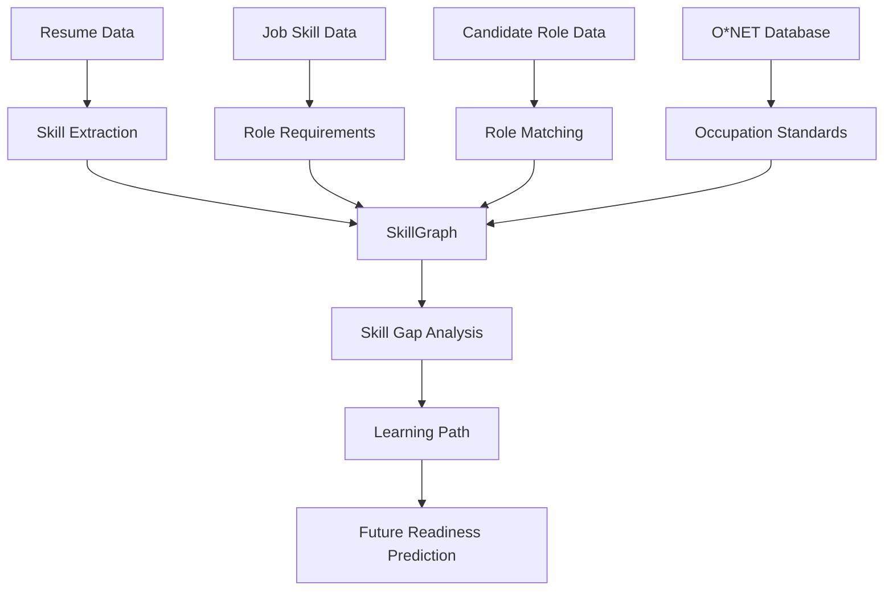

# SkillGraph

SkillGraph is a research-oriented AI system for analyzing workforce skills, identifying skill gaps, understanding career mobility, and eventually predicting readiness for future roles.

## Problem Statement

Organizations may already have employees who could move into future roles, but employee skills, role requirements, career paths, and learning opportunities are often disconnected. SkillGraph aims to connect these components.

## Current Project Phase

**Phase 1 — Data Foundation & Organization**

This repository currently focuses on dataset organization, schema documentation, and establishing the project foundation.

## Dataset Overview

| Dataset | Primary purpose |
|---|---|
| Job Skill Set | Role → Required Skills |
| Resume Dataset | Resume → Skills / Candidate Profile |
| Candidate Job Role | Candidate → Suitable Role |
| O*NET 29.0 Database | Standardized occupation and skill data |

- **Job Skill Set**: Used to map job titles to their required skills and understand role-skill relationships.
- **Resume Dataset**: Used to analyze resume text to identify skills and candidate profile categories.
- **Candidate Job Role**: Connects candidate experience/skills to suitable job roles for potential role matching.
- **O*NET 29.0 Database**: Provides comprehensive occupational definitions, skill requirements, and worker characteristics.

## Why These Datasets?

Job Skill Set ↓ Role requirements  
Resume Dataset ↓ Candidate skills  
Candidate Job Role ↓ Candidate-role relationships  
O*NET 29.0 Database ↓ Standardized occupation and skill data  

Together, they provide the initial data foundation for SkillGraph.

## Research Gap

Existing approaches often focus on resume-to-job matching, static skill-gap analysis, or career recommendation independently. The broader SkillGraph vision combines Skill Gap + Internal Mobility + Prerequisite-Aware Learning + Future Readiness + Workforce Planning.

## Current Scope

Currently implemented:
- [x] Dataset organization & folder structure
- [x] Comprehensive dataset documentation with exact schemas and statistics
- [x] Environment configuration & .gitignore

Next up:
- [ ] Exploratory data analysis (EDA)
- [ ] Skill graph construction
- [ ] NLP pipeline for skill extraction
- [ ] ML prediction models
- [ ] Learning-path recommendation
- [ ] Future readiness model
- [ ] Workforce planning dashboard

## Future Architecture



## Project Structure

```
SkillGraph/
│
├── README.md
├── requirements.txt
├── .gitignore
│
├── data/
│   ├── raw/
│   │   ├── job_skill_set/
│   │   ├── resume_dataset/
│   │   ├── candidate_job_role/
│   │   └── onet_29_0_database/
│   └── processed/
│
└── docs/
    └── dataset_notes.md
```

## Setup

```bash
git clone https://github.com/AbhayMahalle/SkillGraph.git
cd SkillGraph
pip install -r requirements.txt
```

## Data Sources

- Job Skill Set: https://www.kaggle.com/datasets/batuhanmutlu/job-skill-set
- Resume Dataset: https://www.kaggle.com/datasets/trendcart/resume-dataset
- Candidate Job Role: https://www.kaggle.com/datasets/ckshetty/candidate-job-role-dataset
- O*NET 29.0 Database: https://www.kaggle.com/datasets/emarkhauser/onet-29-0-database

## Limitations

Public datasets are not the same as proprietary employee data. Some datasets may be synthetic. The public datasets do not directly provide a complete real-world dataset for: Employee → Course Completed → Skills Improved → Target Role → Successful Internal Transition. Therefore, these datasets alone do not train the complete future-readiness model. Future-readiness prediction will require additional structured data in later phases.
